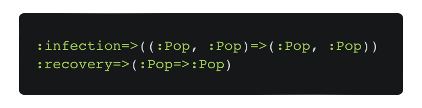
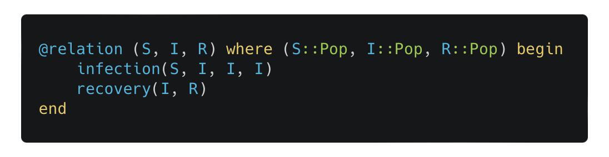
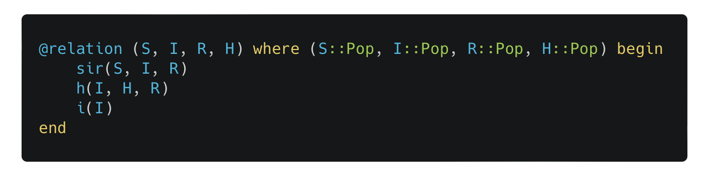
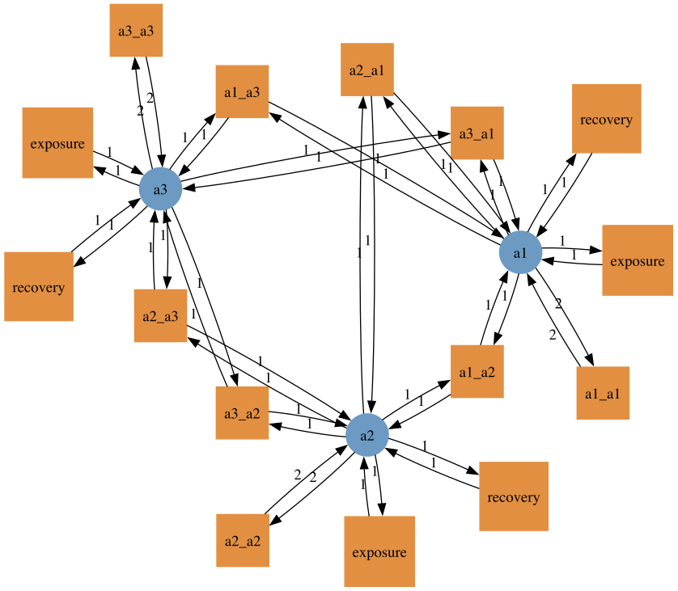
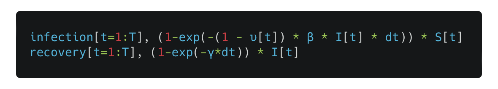
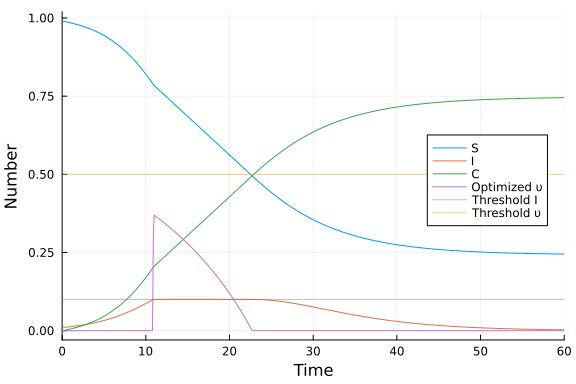

---
title:
output:
  revealjs::revealjs_presentation:
    theme: simple
    css: styles.css
    self_contained: false
    mathjax: local
    reveal_plugins: ["zoom","chalkboard"]
    transition: slide
    background_transition: slide
always_allow_html: yes
---

```{r setup, include=FALSE}
knitr::opts_chunk$set(echo = FALSE)
knitr::opts_chunk$set(fig.align='center')
knitr::opts_chunk$set(fig.width=7)
knitr::opts_chunk$set(fig.height=5)
knitr::opts_chunk$set(out.extra='border:0px;')
options(warn=-1)
```

```{r}
suppressPackageStartupMessages(library(ggplot2))
suppressPackageStartupMessages(library(ggforce))
suppressPackageStartupMessages(library(plotly))
```

```{r}
blank_theme <- theme_minimal()+
  theme(
  axis.title.x = element_blank(),
  axis.title.y = element_blank(),
  panel.border = element_blank(),
  panel.grid=element_blank(),
  axis.ticks = element_blank(),
  plot.title=element_text(size=14, face="bold")
  )
```

<style type="text/css">
code.r{ /* Code block */
    font-size: 28px;
}
code.julia{ /* Code block */
    font-size: 28px;
}
pre { /* Code block - determines code spacing between lines */
    font-size: 32px;
}
</style>

## {data-background=#d3d3d3}

<h2 style="color:#0047AB">Being open and FAIR in modeling infectious diseases for decision support</h2>
<br>
<h3 style="color:#000000">Simon Frost</h3>
<h4 style="color:#000000">Principal Data Scientist, Microsoft Premonition &</h4>
<h4 style="color:#000000">Professor of Pathogen Dynamics, LSHTM</h4>


<h2>
<span style="font-size:24px"> &nbsp;<a href="mailto:simon.frost@lshtm.ac.uk" target="_blank" style="vertical-align:middle">simon.frost@lshtm.ac.uk</a></span>
<span style="font-size:24px"> &nbsp;<a href="http://www.x.com/sdwfrost" target="_blank" style="vertical-align:middle">@sdwfrost</a></span>
<span style="font-size:24px"> &nbsp;<a href="http://github.com/sdwfrost" target="_blank" style="vertical-align:middle">http://github.com/sdwfrost</a></span>
</h2>

## FAIR principles of open science

- **F**indable
- **A**ccessible
- **I**nteroperable
- **R**eproducible
- Often a condition of grant funding

## Going beyond FAIR

- FAIR principles are often achieved through engineering practices
  - GitHub, Docker, notebooks, APIs
- In this talk, I'll discuss how we can might make models *replicable* rather than just *reproducible*
- Ultimate goal: making complex models, their development, and their role in decision support more transparent (at least to experts)
  - Kevin McConway described this as 'intelligent transparency'
  
## Routes to transparency

- New UKRI project 'Building a toolkit for epidemiological models'
- Make models composable
  - Build complex models from simple ones, as simple ones are easier to understand
- Extend these models to optimal control routinely
  - Modeling lays assumptions out
- Increase preparedness as well as improve response times to modify models
- This talk will describe what tools (developed by others) available today can do

## Reverse engineering models is hard

- Why hard?
  - We only see the final product, not the development pathway of the model
  - Models can be complex (Michael Plank mentioned a 'Frankenstein's monster')
  - It is often hard to see how the model could be simplified or extended
- A bottom-up approach, where we make complex models from simple ones is easier to understand
  - Reflects the thought process during modeling
  - 'Show your working'

## Epiverse-TRACE epidemics

- The R package `epidemics` from the Epiverse-TRACE team is described as 'composable epidemic scenario modeling'
- Demographics, contact structures and interventions can all be interchanged, but this is achieved by building a large, complex generic model
  - Modular, but not *composable*


## Applied category theory (ACT) as a tool for composing models

- Mathematical concepts from category theory have been proposed as tools to help 'add' and 'multiply' models
- Barriers
  - The terminology, resulting in a steep learning curve
    - I'll try to highlight connections to epidemiology
  - Applications of ACT to modeling dynamical systems are recent developments
    - [Libkind, Baas, Halter, Patterson & Fairbanks (2022)](https://doi.org/10.1098/rsta.2021.0309)
  - Software implementations were lacking 
    - DARPA funding e.g. 'Automating Scientific Knowledge Extraction and Modeling' (ASKEM) program

## Connections between ACT and epidemiology

| *Term*                                    | *Definition*                                                                                                                                    | *Example in epidemiology*                                                                                                                                                |
| --------------------------------------- | --------------------------------------------------------------------------------------------------------------------------------------------- | ---------------------------------------------------------------------------------------------------------------------------------------------------------------------- |
| Category                                | Includes “objects” representing entities or states and “arrows” (morphisms) representing transitions or relationships between entities.       | Objects: different disease states of an individual (Susceptible, Infected, Recovered).                                                                                 |
| Morphism                                | A mapping, function or transformation from one object to another.                                                                             | The transformation of a person from a susceptible state to an infected state.                                                                                          |
| Domain                                  | The object from which the arrow or morphism originates.                                                                                       | For an arrow representing transmission, the domain would be the susceptible state.                                                                                     |
| Codomain                                | The object to which the arrow points.                                                                                                         | For an arrow representing transmission, the codomain would be the infected state.                                                                                      |

(More examples at [https://github.com/epirecipes/EpiCats](https://github.com/epirecipes/EpiCats))

## An SIR example

- Consider a category $C$
  - Objects representing the potential states of the system $(S, I, R)$.
  - Morphisms representing transitions (infection, recovery)
- The functor \(X: C \to \mathbf{Set}\) is known as a C-Set (or a copresheaf on C) has two components:
  - Object mapping: e.g. map the object \( \text{S} \) (Susceptible) to the set \( X(\text{S}) \) of all susceptible individuals.
  - Function mapping: e.g. map the morphism `infection` to a function \(X(\text{infection})\) representing the infection process.

## Whole grain Petri nets


## Composing models

- Define a labelled Petri net with transitions
- Create a wiring diagram (model agnostic!)
- Apply the wiring diagram to the Petri net to create an attributed C set (ACSet)
- Extract the Petri net from the ACSet

## Example: adding hospitalization to an SIR model

- Let's say we have an SIR model already implemented and we want to extend the model to one where the pathogen is more virulent
  - Hospitalization of infected individuals
  - Death of infected and hospitalized individuals
- ACT provides a formalism to glue models together

## Defining a model

{width="50%"}
{width="50%"}


## Component models


## Glueing models together

{width="70%"}

{width="70%"}

## Stratifying models

- Where the real power of this approach becomes apparent is when *stratifying* models
- Consider:
  - Age groups
  - Risk groups
  - Spatial locations
  - Vaccine doses
  - Strains

## COEXIST

{width="70%"}
[https://github.com/gbohner/coexist](https://github.com/gbohner/coexist)

## Stratification approach

- Choose component models
- Choose which compartments will be stratified
- Generate product of models
- Example: replicating the 'default model' from the R `epidemics` package
  - Age structured SEIRV model

## Component models


{width="40%"}


{width="40%"}

(The above was generated by a function `make_age_groups(3)`)

## Choosing how to stratify

{width="40%"}


{width="40%"}

## Taking the product


## Generation of ODEs

<small>

$$
\begin{align}
\frac{\mathrm{d} S_{a2}\left( t \right)}{\mathrm{d}t} =&  - \left( I_{a2}\left( t \right) S_{a2}\left( t \right) \beta_{a2\_a2} + S_{a2}\left( t \right) I_{a1}\left( t \right) \beta_{a2\_a1} + S_{a2}\left( t \right) I_{a3}\left( t \right) \beta_{a2\_a3} \right) \\
\frac{\mathrm{d} I_{a2}\left( t \right)}{\mathrm{d}t} =& E_{a2}\left( t \right) \sigma_{a2} + S_{a3}\left( t \right) I_{a2}\left( t \right) \beta_{a3\_a2} + S_{a1}\left( t \right) I_{a2}\left( t \right) \beta_{a1\_a2} + I_{a2}\left( t \right) S_{a2}\left( t \right) \beta_{a2\_a2} - \left( I_{a2}\left( t \right) \gamma_{a2} + S_{a3}\left( t \right) I_{a2}\left( t \right) \beta_{a3\_a2} + S_{a1}\left( t \right) I_{a2}\left( t \right) \beta_{a1\_a2} + I_{a2}\left( t \right) S_{a2}\left( t \right) \beta_{a2\_a2} \right) \\
\frac{\mathrm{d} E_{a2}\left( t \right)}{\mathrm{d}t} =& I_{a2}\left( t \right) S_{a2}\left( t \right) \beta_{a2\_a2} + S_{a2}\left( t \right) I_{a1}\left( t \right) \beta_{a2\_a1} + S_{a2}\left( t \right) I_{a3}\left( t \right) \beta_{a2\_a3} - E_{a2}\left( t \right) \sigma_{a2} \\
\frac{\mathrm{d} R_{a2}\left( t \right)}{\mathrm{d}t} =& I_{a2}\left( t \right) \gamma_{a2} \\
\frac{\mathrm{d} S_{a3}\left( t \right)}{\mathrm{d}t} =&  - \left( S_{a3}\left( t \right) I_{a2}\left( t \right) \beta_{a3\_a2} + S_{a3}\left( t \right) I_{a1}\left( t \right) \beta_{a3\_a1} + S_{a3}\left( t \right) I_{a3}\left( t \right) \beta_{a3\_a3} \right) \\
\frac{\mathrm{d} I_{a3}\left( t \right)}{\mathrm{d}t} =& E_{a3}\left( t \right) \sigma_{a3} + S_{a3}\left( t \right) I_{a3}\left( t \right) \beta_{a3\_a3} + S_{a1}\left( t \right) I_{a3}\left( t \right) \beta_{a1\_a3} + S_{a2}\left( t \right) I_{a3}\left( t \right) \beta_{a2\_a3} - \left( I_{a3}\left( t \right) \gamma_{a3} + S_{a3}\left( t \right) I_{a3}\left( t \right) \beta_{a3\_a3} + S_{a1}\left( t \right) I_{a3}\left( t \right) \beta_{a1\_a3} + S_{a2}\left( t \right) I_{a3}\left( t \right) \beta_{a2\_a3} \right) \\
\frac{\mathrm{d} E_{a3}\left( t \right)}{\mathrm{d}t} =& S_{a3}\left( t \right) I_{a2}\left( t \right) \beta_{a3\_a2} + S_{a3}\left( t \right) I_{a1}\left( t \right) \beta_{a3\_a1} + S_{a3}\left( t \right) I_{a3}\left( t \right) \beta_{a3\_a3} - E_{a3}\left( t \right) \sigma_{a3} \\
\frac{\mathrm{d} R_{a3}\left( t \right)}{\mathrm{d}t} =& I_{a3}\left( t \right) \gamma_{a3} \\
\frac{\mathrm{d} S_{a1}\left( t \right)}{\mathrm{d}t} =&  - \left( S_{a1}\left( t \right) I_{a2}\left( t \right) \beta_{a1\_a2} + S_{a1}\left( t \right) I_{a1}\left( t \right) \beta_{a1\_a1} + S_{a1}\left( t \right) I_{a3}\left( t \right) \beta_{a1\_a3} \right) \\
\frac{\mathrm{d} I_{a1}\left( t \right)}{\mathrm{d}t} =& E_{a1}\left( t \right) \sigma_{a1} + S_{a3}\left( t \right) I_{a1}\left( t \right) \beta_{a3\_a1} + S_{a1}\left( t \right) I_{a1}\left( t \right) \beta_{a1\_a1} + S_{a2}\left( t \right) I_{a1}\left( t \right) \beta_{a2\_a1} - \left( I_{a1}\left( t \right) \gamma_{a1} + S_{a3}\left( t \right) I_{a1}\left( t \right) \beta_{a3\_a1} + S_{a1}\left( t \right) I_{a1}\left( t \right) \beta_{a1\_a1} + S_{a2}\left( t \right) I_{a1}\left( t \right) \beta_{a2\_a1} \right) \\
\frac{\mathrm{d} E_{a1}\left( t \right)}{\mathrm{d}t} =& S_{a1}\left( t \right) I_{a2}\left( t \right) \beta_{a1\_a2} + S_{a1}\left( t \right) I_{a1}\left( t \right) \beta_{a1\_a1} + S_{a1}\left( t \right) I_{a3}\left( t \right) \beta_{a1\_a3} - E_{a1}\left( t \right) \sigma_{a1} \\
\frac{\mathrm{d} R_{a1}\left( t \right)}{\mathrm{d}t} =& I_{a1}\left( t \right) \gamma_{a1}
\end{align}
$$

</small>

## Benefits

- Mathematical language (and associated implementation in code) to add and multiply models
- Easy to simplify a model, to extend, to swap out components
- Aids in reusability (preparedness) and in transparency (accountability)
- Under active development
  - Kris Brown and Sean Wu are developing algebraic agent based models
  - How (best) to represent interventions?

## Optimizing policy

- Much interest in comparing interventions
  - Many studied considered a small set of interventions
  - Fewer used optimal control to identify the 'best' one
- Many optimal control papers published during the pandemic used indirect methods
  - Numerical results were often tuned too e.g. for 'bang-bang' interventions
- While analytical results are preferable, they may not be easily derived on a short timescale
  - Can we automate numerical approaches for optimal control?

## Techniques for optimal control

- Indirect methods, requiring more (manual) mathematical analysis but allowing proofs
  - Pontryagin's maximum principle
  - Hamilton–Jacobi–Bellman equation
- Direct methods, numerical approaches that can be automated
  - Discretize the model and treat as a nonlinear program (NLP)

## Nonlinear programs

\[ \text{minimize} \quad f(x) \]
\[ \text{subject to} \quad g_i(x) \leq 0 \quad \forall i \in \{1, \ldots, m\} \]
\[ h_j(x) = 0 \quad \forall j \in \{1, \ldots, p\} \]
\[ x_L \leq x \leq x_U \]

<small>

- \( f(x) \) is the objective function, which is nonlinear and can be non-convex.
- \( g_i(x) \) are inequality constraints, which can also be nonlinear.
- \( h_j(x) \) are equality constraints, which can be nonlinear as well.
- \( x_L \) and \( x_U \) are the lower and upper bounds on the decision variables \( x \).

</small>

## Barriers against use of NLP solvers

- Mathematical solvers are used extensively in logistics, supply chain, etc., but less widely used in epidemiology
  - Cost?
  - Ease of use?
  - Lack of awareness?
- Initial exploration: direct method using mathematical optimization of nonlinear programs
  - How much effort to port compartmental models to integrate them with solvers?
  - Can we use free solvers?
  - Does the solver get the right answer (or even an answer at all)?
  - Is it fast enough to be useful?

## Components

- Objectives:
  - Reduce total infected
  - Flatten the curve
  - Reduce peak infected
- Interventions
  - Contact reduction
  - Vaccination

## Model formulation

- Discretized equations of dynamics can be written as nonlinear constraints, resulting in an NLP
- Solved using Ipopt, a free NLP solver
- Models written using a domain-specific language, JuMP
  - Alternatives include AMPL, GAMS, Pyomo...(not one for R, sorry...)

## Reduce contact rate

$$
\begin{align*}
\dfrac{\mathrm dS}{\mathrm dt} &= -\beta (1 - \upsilon(t)) S I, \\
\dfrac{\mathrm dI}{\mathrm dt} &= \beta (1 - \upsilon(t)) S I - \gamma I,\\ 
\dfrac{\mathrm dC}{\mathrm dt} &= \beta (1 - \upsilon(t)) S I\\
\end{align*}
$$

## Writing the model as expressions and constraints




## Aside: a domain specific language for differentiation/integration

- There is a (Julia only) package, `InfiniteOpt.jl`, that allows constraints to be specified in terms of derivatives and integrals
  - Discretization occurs 'under the hood'


## Reducing total infected

- Minimise $C(\infty)$
- Subject to:
  - $\nu(t) \leq \nu_{max}$
  - $\int \nu(t) dt \leq \nu_{total}$
- [Britton and Leskela (2023)](https://doi.org/10.1137/22M1504433) have proven that the optimal policy is a single 'bang-bang' intervention


## NLP closely matches the analytical optimum

{width="110%"}

## Flattening the curve

- Minimise total cost of intervention while keeping infected individuals below a pre-specified level
- [Miclo et al. (2022)](https://doi.org/10.1016/j.jmateco.2022.102669) demonstrated that the optimal control is in three stages; wait, maintain, and relax 


## Numerical results for flattening the curve

{width="110%"}

## Vaccination

$$
\begin{align*}
\dfrac{\mathrm dS}{\mathrm dt} &= -\beta S I - \upsilon(t) S, \\
\dfrac{\mathrm dI}{\mathrm dt} &= \beta S I - \gamma I,\\ 
\dfrac{\mathrm dC}{\mathrm dt} &= \beta S I\\
\end{align*}
$$

## Optimal vaccination

- The optimal approach is to vaccinate as early as possible

{width="80%"}

## Results

- Ipopt, a free nonlinear solver, can reproduce analytical results on optimal policies quickly, with little tuning
  - Despite not 'knowing' about the time series nature of the model (although smoothness penalties can easily be added)
  - Fast enough for uncertainty analysis across many parameter values
- Initial conditions (based on the absence of interventions) reduced computational time
- The accuracy of the discretization did not appear to matter too much
  - Simple Euler vs. second-order model

## Issues with solvers

- Not all NLP solvers allow nonlinear equalities/inequalities
  - e.g. NLopt, SCIP
- Some solvers fail to find a solution at all
  - e.g. Bonmin
- Some solvers are much slower than others
  - e.g. MAinGO
- Some solvers returned suboptimal solutions

## Issues with models

- Too coarse discretization
 - Trade-off with runtime
- Minimising *duration* of intervention can be more difficult
  - Turns NLP into a mixed integer (MINLP) problem
  - Can be either much faster (bang-bang intervention) or much slower
  
## Alternative approaches to NLP solvers

- Deep learners for $u(t)$ get stuck in local minima
  - 'Smooth' policies such as vaccination can be fitted
  - Non-pharmaceutical interventions are harder
- (Partially observed) Markov decision processes struggle with final size limitation
- Yet to find a good representation of the problem for reinforcement learning

## Conclusions

- Applied category theory (ACT) is a promising method to 'show your working' when building complex models, making models more re-usable and transparent
  - Offers compositionality, abstraction, and formalism
- Writing deterministic models (ODEs/maps) as nonlinear programs can quickly identify optimal policies
  - Great as a 'hypothesis generating' approach
  - We're trying to build an automated framework that works quickly for all model types and interventions
- Potential to apply ACT to optimal control and data inputs and combine with transmission models in a single framework

## Links

- [http://github.com/epirecipes/EpiCats](http://github.com/epirecipes/EpiCats)
- [http://epirecip.es](http://epirecip.es) (Outdated)
- [http://github.com/epirecipes/sir-julia](http://github.com/epirecipes/sir-julia)
  - ACT for ODEs by Sophie Libkind and for stock flow models
  - Optimal control examples
  - Emulators
  - Probabilistic programming languages (Turing, Gen, RxInfer)
  - ABC

## Acknowledgements

- Tom Britton, for piquing my interest in optimising policies
- Sean Wu, for lots of contributions to Epirecipes
- Oscar Dowson, for help with JuMP
- Micah Halter, Sophie Libkind, James Fairbanks and the AlgebraicJulia community
- U.K. Medical Research Council 'Better Methods, Better Research' for funding
  - Roz Eggo (LSHTM), Mike Gravenor and Ashley Akhbari (Swansea U.)

## Thanks!

<h2>
<span style="font-size:24px"> &nbsp;<a href="mailto:simon.frost@lshtm.ac.uk" target="_blank" style="vertical-align:middle">simon.frost@lshtm.ac.uk</a></span>
<span style="font-size:24px"> &nbsp;<a href="http://www.x.com/sdwfrost" target="_blank" style="vertical-align:middle">@sdwfrost</a></span>
<span style="font-size:24px"> &nbsp;<a href="http://github.com/sdwfrost" target="_blank" style="vertical-align:middle">http://github.com/sdwfrost</a></span>
</h2>

Possibly of interest:<br>
[http://microsoft.com/premonition](http://microsoft.com/premonition)<br>
[http://digitalbiome.org](http://digitalbiome.org)
